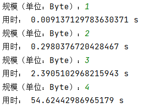
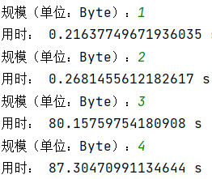

# SM3生日攻击
## 基本思想
1. 随机生成消息
2. 计算消息的sm3杂凑值
3. 寻找碰撞
## 运行指导
实现了两个版本的sm3生日攻击。 
* sm3_Birthday_Attack_gmssl.py：使用gmssl库中的sm3实现 
* sm3_Birthday_Attack_mysm3.py：使用自己写的sm3.py实现 

运行sm3_Birthday_Attack_gmssl.py（或sm3_Birthday_Attack_mysm3.py）文件，输入碰撞规模：  
* 若想寻找杂凑值前 8n bit的碰撞，则输入n； 
* 若想结束程序，则输入0。
## 运行结果
均实现了32bit的生日攻击
* sm3_Birthday_Attack_gmssl.py

* sm3_Birthday_Attack_mysm3.py

