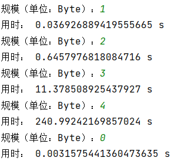

# Rho-method-of-reduced-SM3
## Pollard Rho原理

通过迭代实现杂凑值的更新。

## 关键代码
~~~
def Rho(n):
    x = random.random()
    h1 = SM3(x)
    h2 = SM3(h1)
    while 1:
        h1 = SM3(h1)
        h2 = SM3(SM3(h2))
        if h1[:n] == h2[:n]:
            break
    return (h1[:n], h2[:n])
~~~
其中，参数为n，找到的碰撞为SM3杂凑值的前8nbit。
## 运行指导
实现了两个版本的sm3 Rho。 
* sm3_Rho_gmssl.py：使用gmssl库中的sm3实现 
* sm3_Rho.py：使用自己写的sm3.py实现 

运行sm3_Rho_gmssl.py（或sm3_Rho.py）文件，输入碰撞规模：  
* 若想寻找杂凑值前 8n bit的碰撞，则输入n； 
* 若想结束程序，则输入0。
## 运行结果
* sm3_Rho.py

|n|前几bit|time(单位:s)|
|:----:|:----:|:----:|
|1|8|0.6923840284347534|
|2|16|16.820635652542116|
|3|24|414.7569657087326|
|4|32|8057.379549980164|

* sm3_Rho_gmssl.py

