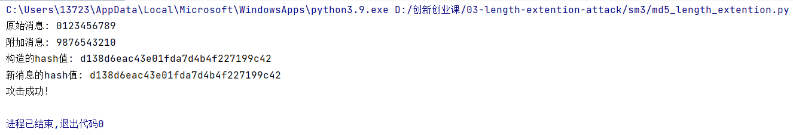

# md5的长度扩展攻击

## 实验步骤

    1.首先计算原消息msg的hash值 
    2.在msg+padding之后附加一段消息,用原消息的hash值作为IV计算附加消息之后的hash值,得到消息扩展后的hash_attack 
    3.用md5得到hash_extend 
    4.验证hash_attack 与 hash_extend 是否相等 
## 运行指导
运行文件md5_length_extention.py
## 运行结果
攻击成功
